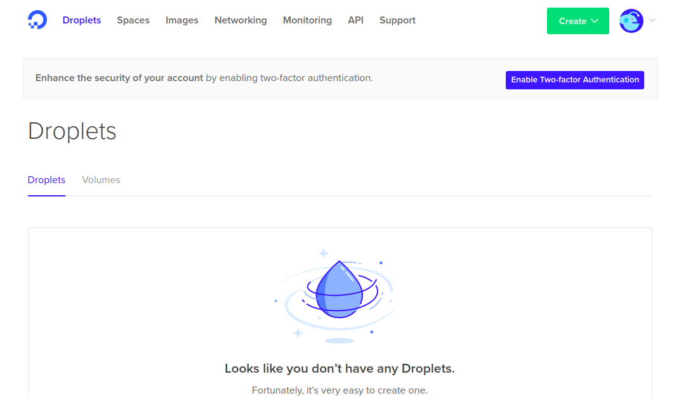
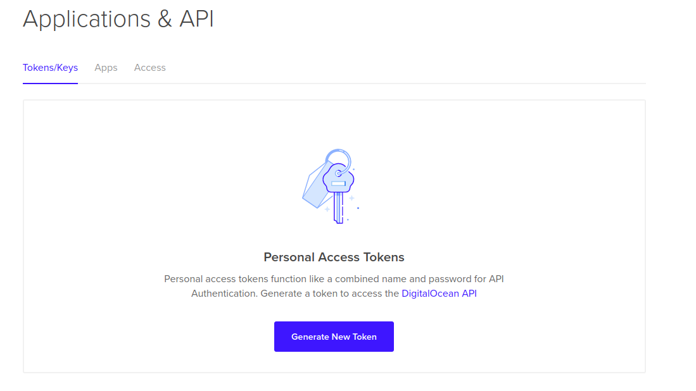
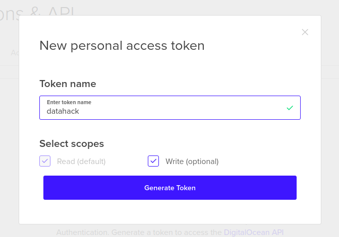
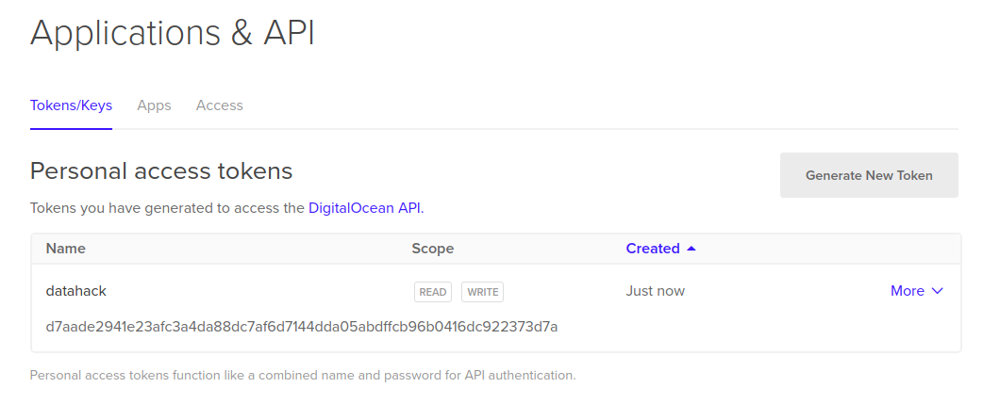

### Running Docker Containers on Cloud Platforms

Docker provides us the easiest way to run our containers on public cloud platforms - AWS, Azure, Google Cloud Platform, etc. You can do this via `docker-machine`. What `docker-machine` is: 

> Docker Machine is a tool that lets you install Docker Engine on virtual hosts, and manage the hosts with `docker-machine` commands. You can use Machine to create Docker hosts on your local Mac or Windows box, on your company network, in your data center, or on cloud providers like Azure, AWS, or Digital Ocean. Using `docker-machine` commands, you can start, inspect, stop, and restart a managed host, upgrade the Docker client and daemon, and configure a Docker client to talk to your host.

__How to install `docker-machine`:__

- Follow the steps in this [link](https://docs.docker.com/machine/install-machine/)

__Why `docker-machine`:__

When you do a `docker run hello-world`, the docker daemon understands that you want to create a container using the `hello-world` image. It searches for the same in DockerHub repository, downloads it and you get the output. 

All this happens in your local system. In our use-case, we need to manage `machines` that run their own docker engines (daemons) remotely. `docker-machine` helps us in deploying and managing them. `docker-machine` API helps to create machines on almost all the major cloud service providers & just needs a few commands to get docker containers to deploy on them.

To reference the various cloud providers, we have drivers: Listed [here](https://docs.docker.com/machine/drivers/)

`docker-machine` __Initializing VM in Cloud Example:__ [Here](https://docs.docker.com/machine/examples/ocean/)

- `docker-machine` on __DigitalOcean__:
    * Login to your Digital Ocean account and navigate to the dashboard.
    * Follow the steps below:
        - 
        
        - 
        
        - 
        
        - 
    * Add the key to `.bashrc`, `export DIGITALOCEAN_ACCESS_TOKEN=<api-key>`

    * RUN: `docker-machine create --driver digitalocean --digitalocean-access-token $DIGITALOCEAN_ACCESS_TOKEN --engine-install-url=https://web.archive.org/web/20170623081500/https://get.docker.com <machine-name,your choice>`
    * More commands listed [here](https://docs.docker.com/machine/drivers/digital-ocean/)
    * You can be generous in using this referral link: [Referrals](https://m.do.co/c/e771bc3fe004) to get $10 credits.

- `docker-machine` on __AWS__:
    * Make sure you have your __AWS Credentials__ already setup. To setup those, visit [this link AWS CLI installation](http://docs.aws.amazon.com/cli/latest/userguide/installing.html) and [this link to configure your keys](http://docs.aws.amazon.com/cli/latest/userguide/cli-chap-getting-started.html)
    * Run: `docker-machine create --driver amazonec2 --amazonec2-region us-east-1 --amazonec2-instance-type t2.micro --engine-install-url=https://web.archive.org/web/20170623081500/https://get.docker.com --amazonec2-open-port 5000 <machine-name,your choice>`

    
- Listing all the `docker-machines`:
    * `docker-machine ls`
    
- To activate(?) the `docker-machine` we need:
    * `docker-machine env <machine-name>`
    * `eval $(docker-machine env <machine-name>)`
    
- Downloading `hello-world` image to `docker-machine`:
    * `docker pull hello-world`
    
- Check whether we have the image:
    * `docker images`
    
- Run the image (Note: This entire operation is running in the <machine-name>, not on your terminal):
    * `docker run hello-world`
    
- To check whether the `docker-machine` really has the image downloaded to it:
    * SSH in the `docker-machine`: `docker-machine ssh <machine-name>`
    * Do: `docker images`
    * Voila! You will see the `hello-world` image in the output!